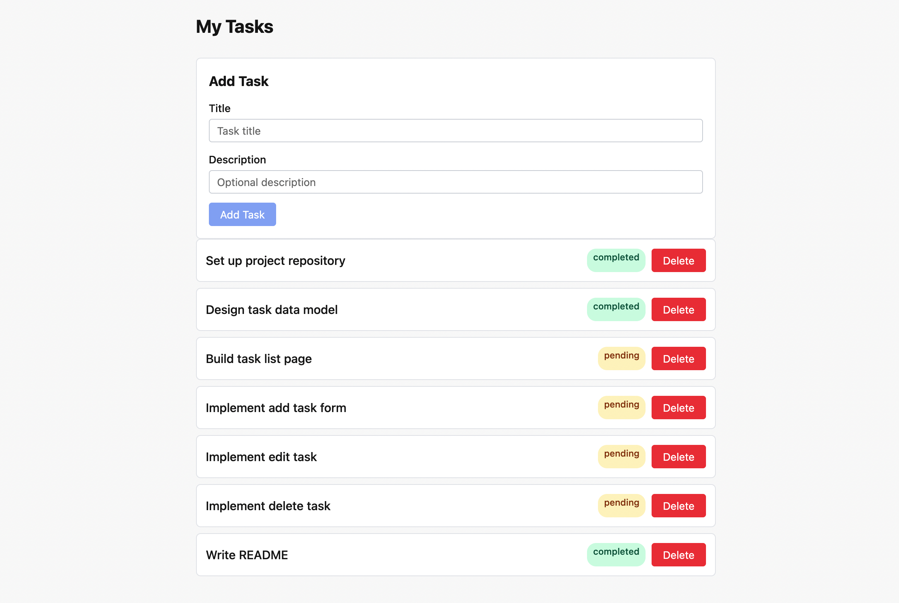

# Personal Task Manager

A simple personal task manager built with React + TypeScript. Supports creating, editing, and deleting tasks, with localStorage persistence so your tasks survive page reloads.
**Live Demo**: https://personal-task-manager-lovat.vercel.app


## Features

- [x] View a list of tasks with title, description, and status
- [x] Add new tasks
- [x] Edit task title and description
- [x] Delete tasks
- [x] Tasks persist across page refreshes (localStorage)

## Tech Stack

- [React 19](https://react.dev/) + [TypeScript](https://www.typescriptlang.org/)
- [Vite](https://vite.dev/) for bundling and dev server
- [React Router v6](https://reactrouter.com/) for client-side routing
- State management: React hooks (no external state libraries)

## Getting Started

### Prerequisites

- Node.js 20.19+ or 22+
- npm >= 10

### Installation

```bash
git clone https://github.com/HDC432/personal-task-manager.git
cd personal_task_manager
npm install
```

### Run locally

\`\`\`bash
npm run dev
\`\`\`

Open [http://localhost:5173](http://localhost:5173) in your browser.

## Available Scripts

| Command | Description |
|---------|-------------|
| `npm run dev` | Start dev server at http://localhost:5173 |
| `npm run build` | Build for production to `dist/` |
| `npm run preview` | Preview production build at http://localhost:4173 |
| `npm run lint` | Run ESLint |

## Project Structure

```
src/
├── types/          TypeScript interfaces and types
├── data/           Hardcoded mock tasks
├── hooks/          useTasks — central state management
├── components/     Reusable UI components
└── pages/          Route-level page components
```

## Routes

| Path | Page | Description |
|------|------|-------------|
| `/` | Task List | Shows all tasks; add new tasks from here |
| `/tasks/:id` | Task Detail | View, edit or delete a single task |

## Design Decisions

**State management:** All task state lives in a single `useTasks` hook, called once in `App` and passed down via props. This is deliberate — calling `useTasks()` in multiple components creates independent state instances, which means changes in one component wouldn't reflect in another. For a project of this size, prop drilling to two pages is straightforward; Context or Redux would add complexity without meaningful benefit.

**Inline editing on the detail page:** Editing happens at `/tasks/:id` via a read/edit mode toggle, not a modal. This makes meaningful use of the routing structure required by the assignment and keeps each page's responsibility clear: the list page handles overview and creation, the detail page handles viewing and editing.

**Styling:** Plain CSS in a single `index.css`, not CSS Modules or Tailwind. The assignment emphasizes functionality over style, and at 6–7 components the overhead of a styling framework wasn't justified.

**Persistence:** Tasks are persisted to `localStorage` via lazy `useState` initialization and a `useEffect` write-back. `JSON.parse` is wrapped in `try/catch` so a corrupt storage value falls back to mock data instead of crashing the app. Limitation: `localStorage` is single-device and single-browser; a real app would replace this with a backend API.

## Notes

- Mock task IDs use simple strings (`'1'`–`'7'`) for readability during development, while user-created tasks use `crypto.randomUUID()`. Both work correctly since lookups are always dynamic (`tasks.find(t => t.id === id)`).
- When all tasks are deleted, the list renders empty with no explicit message. Adding a "No tasks yet" empty state would be a straightforward next iteration.
- The app uses React.StrictMode in development, which intentionally double-invokes component functions to surface side effects. This is dev-only and does not affect production builds.
